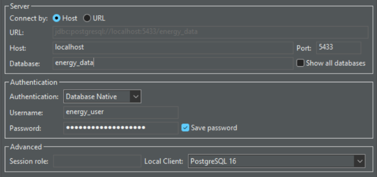
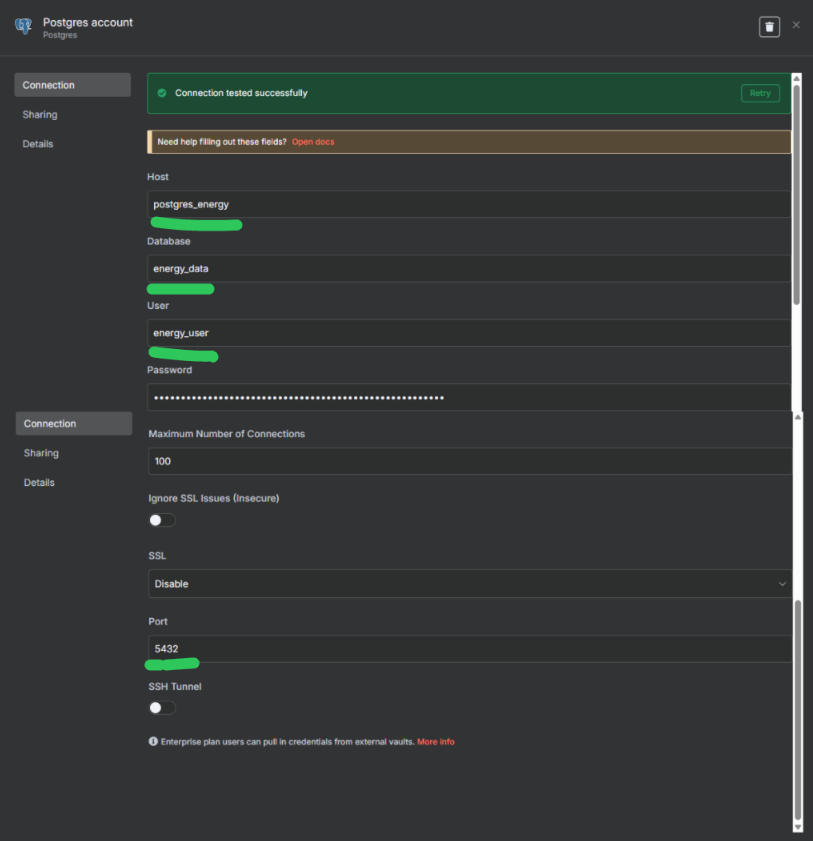
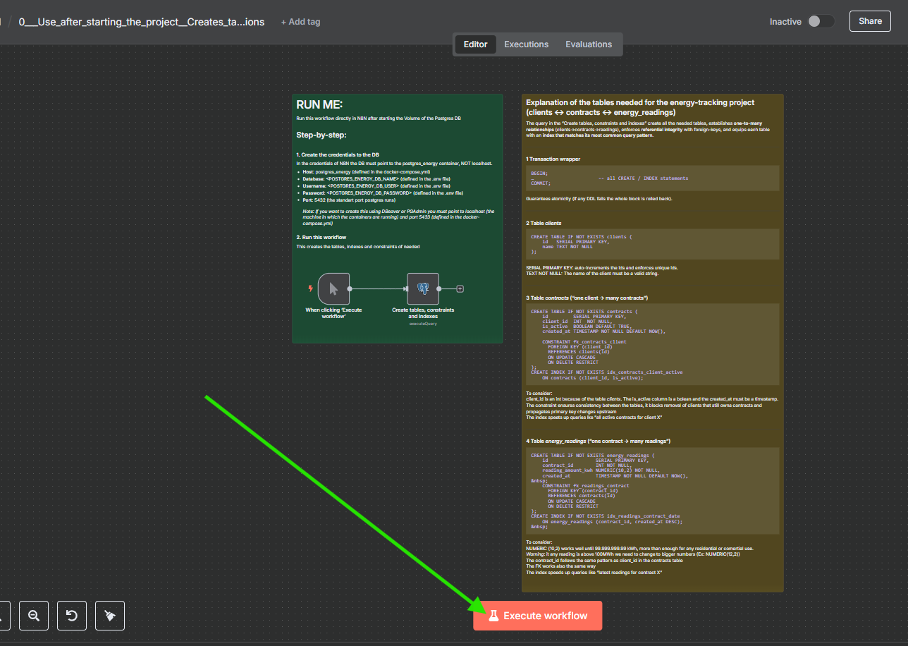
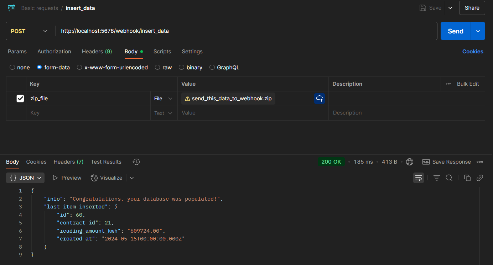
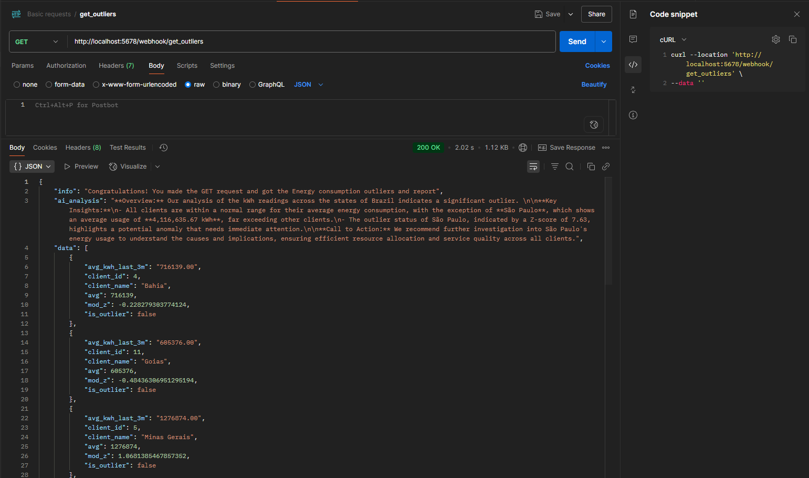
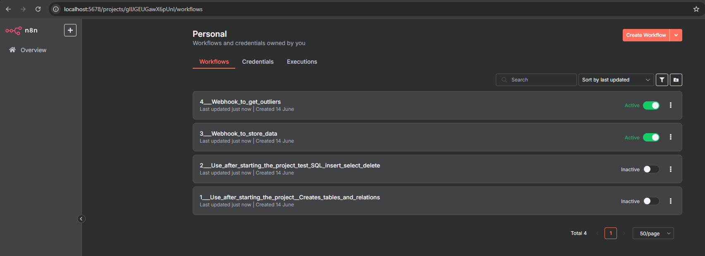

# energy_db_automation_n8n
**Dockerized aplication** that runs N8N with Postgres to **store and automate processes** about different client's energy consumption.

This project is meant to run 3 containers, one for N8N, one for the internal database of N8N (to store workflows) and one for the client's actual data.

All the N8N workflows are included in the folder **nun_work_flows**. To understand the project specifications you must read the sticky notes inside the workflow.

[*Made by Vinicius Schaedler Damin*](https://www.linkedin.com/in/viniciusdamin/)

## 📑 Summary
- [0. Business understanding](#0-bussiness-understanding-of-the-project)
- [1. 🏎️ Start N8N](#1-start-n8n)
  - [1.1 ⚙️ Configuration](#11-️⚙️-configuration)
  - [1.2 🛠️ Testing conection to Client's Energy DB - DEV](#12-🛠️-testing-conection-to-clients-energy-db---dev)
  - [1.2.1 Testing Outside N8N](#121-testing-outside-n8n)
  - [1.2.2 Testing Inside N8N](#122-testing-inside-n8n)
- [2. 👀 Using N8N](#2-👀-using-n8n)
  - [2.1 👀 Inserting real-world data](#21-👀-inserting-real-world-data-into-db-n8n-webhook)
  - [2.2 🤩 Obtaining outlier analysis](#-22-🤩-obtaining-outlier-analysis-n8n-webhook)
- [🎉 Congratulations!](#🎉-congratulations)
- [Next steps](#next-steps)

## 0. Bussiness understanding of the project
*(If you just want to run the project skip to section [1. 🏎️ Start N8N](#1-start-n8n))*

This project answers a single business question: **“How is each currently-active customer consuming energy right now, and who looks unusual?”**
To do that we apply six clear rules:

- **Active client:** a customer enters the report only if they have at least one contract where is_active = TRUE; inactive customers are ignored.

- **Recent readings only:** we analyse consumption recorded in the last 3 months, counted from the system date (created_at ≥ NOW() – 3 months).

- **All readings for an active client:** if the customer is active, we take every reading in that window, even if the contract that logged it is no longer active, because the business cares about the customer’s full recent demand.

- **Average consumption:** for each active client we calculate the simple average of reading_amount_kwh across those recent readings.

- **Exclude empty histories:** clients with no readings in the period are dropped; there is no actionable data for them.

- **Consolidate contracts:** a client may hold many contracts, but we merge all their readings before computing the average so each customer appears once.

The n8n workflow (triggered by a webhook) runs an SQL query that enforces these rules, computes the averages, flags outliers with a modified-z score, generates a **quick analysis of the data made by AI** and returns the enriched JSON to the user. This lets the company monitor active customers’ behaviour in near-real time and **react quickly to abnormal consumption patterns**.

## 1. Start N8N

To start n8n with PostgreSQL (internal) and PostgreSQL (clients data) simply start **docker-compose by executing the following
command in the root folder of this repository**.

**IMPORTANT:** Before you do that change the default users and passwords in the [`.env`](.env) file! (Use the .env.dev as an example). And if you are running on Linux change the [init-data.sh file](init-data.sh)

```
docker-compose up -d
```

You must see in the terminal
```
[+] Running 7/7
 ✔ Network energy_db_automation_n8n_default              Created                                                                                                                            0.1s 
 ✔ Volume "energy_db_automation_n8n_n8n_storage"         Created                                                                                                                            0.0s 
 ✔ Volume "energy_db_automation_n8n_energy_db_storage"   Created                                                                                                                            0.0s 
 ✔ Volume "energy_db_automation_n8n_db_storage"          Created                                                                                                                            0.0s 
 ✔ Container energy_db_automation_n8n-postgres_energy-1  Started                                                                                                                            0.7s 
 ✔ Container energy_db_automation_n8n-postgres-1         Healthy                                                                                                                            6.3s 
 ✔ Container energy_db_automation_n8n-n8n-1              Started  
```

Done! You are ready to use N8N to work with your data! You can access it in **http://localhost:5678/**. To see what you can do inside N8N go to the section "Using N8N"

To stop it execute:

```
docker-compose stop
```
Note: **use this when testing workflows**. It does not delete the workflows in n8n and the data in the clients energy database

Or, if you want to **DELETE ALL DATA** to start all over, you must also delete the volumes (-v)

```
docker-compose down -v
```
Note: **never use this in production**. It deletes the Databases!

and with the comand above you must see
```
[+] Running 7/7
 ✔ Container energy_db_automation_n8n-n8n-1              Removed                                                                                                                            0.6s 
 ✔ Container energy_db_automation_n8n-postgres_energy-1  Removed                                                                                                                            0.6s 
 ✔ Container energy_db_automation_n8n-postgres-1         Removed                                                                                                                            0.4s 
 ✔ Volume energy_db_automation_n8n_db_storage            Removed                                                                                                                            0.1s 
 ✔ Volume energy_db_automation_n8n_n8n_storage           Removed                                                                                                                            0.1s 
 ✔ Volume energy_db_automation_n8n_energy_db_storage     Removed                                                                                                                            0.1s 
 ✔ Network energy_db_automation_n8n_default              Removed 
```


###  1.1 ⚙️ Configuration
The default name of the database, user and password for both PostgreSQLs can be changed in the [`.env`](.env) file in the current directory. Use the [.env.dev](.env.dev) as an example

###  1.2 🛠️ Testing conection to Client's Energy DB - DEV
If the Docker compose was used there will be a Postgres instance running on port 5432 of the `postgres_energy` container. The host (localhost, your machine) exposes the port 5433 and redirects it to 5432 of the `postgres_energy` container.

#### 1.2.1 Testing Outside N8N
- Host: localhost
- Database: (POSTGRES_ENERGY_DB_NAME)
- Username: (POSTGRES_ENERGY_DB_USER)
- Password: (POSTGRES_ENERGY_DB_PASSWORD)
- Port: 5433

It should look like this (in Dbeaver)



#### 1.2.2 Testing Inside N8N
In the credentials of N8N the DB must point to the postgres_enery container, NOT localhost.
- Host: postgres_energy
- Database: (POSTGRES_ENERGY_DB_NAME)
- Username: (POSTGRES_ENERGY_DB_USER)
- Password: (POSTGRES_ENERGY_DB_PASSWORD)
- Port: 5432
The n8n credential should look like this



## 2. 👀 Using N8N
After you started all the containers
1. Go to **http://localhost:5678/** and set up the owner account (you can just put random info here if you are testing)
2. Create the credential for the Client's Postgres DB (the one that has the energy info). See the section [1.2.2 Testing Inside N8N](#122-testing-inside-n8n)
3. Create the credential for the OpenAI API (use your own OpenAI API Key, this repository does not provide one and if you do not have the section 2.2 won't work)
3. Go to "Create workflow", select "Import from file" and select the workflows inside the folder **n8n_work_flows**. Do this for all Workflows. Rename them so you keep organized.
4. Open each workflow and **select your credentials FOR EACH POSTGRESS AND LLM NODE**
5. Done!

All the **relevant information** about how to test the application is **inside the workflows**! They **must be executed in order** for you to test the whole aplication, so look at the names in the folder **n8n_work_flows** and follow the numeric order:
1. Start by running the "[1___Use_after_starting_the_project__Creates_tables_and_relations.json](n8n_work_flows/1___Use_after_starting_the_project__Creates_tables_and_relations.json)"



2. Run "[2___Use_after_starting_the_project_test_SQL_insert_select_delete](n8n_work_flows/2___Use_after_starting_the_project_test_SQL_insert_select_delete.json)"
3. Activate the workflow "[3___Webhook_to_store_data](n8n_work_flows/3___Webhook_to_store_data.json)"
4. Activate the workflow "[4___Webhook_to_get_outliers](n8n_work_flows/4___Webhook_to_get_outliers.json"

### 👀 2.1 Inserting real world data into DB (n8n webhook)

Send the following POST request [(available in Postman)](https://.postman.co/workspace/My-Workspace~7f422de4-6c94-4f6c-8995-58975a0e0a16/request/45052632-86ec8740-b7ae-4840-9d19-74b6d414f772?action=share&creator=45052632&ctx=documentation) with the following zipped file: [send_this_data_to_webhook.zip](files_to_test_webhook/send_this_data_to_webhook.zip) 

Example:
```
curl --location 'http://localhost:5678/webhook/insert_data' \
--form 'zip_file=@"/your_path_to_the_repository/energy_db_automation_n8n/files_to_test_webhook/send_this_data_to_webhook.zip"'
```

And the response should be:
```
{
    "info": "Congratulations, your database was populated!",
    "last_item_inserted": {
        "id": 60,
        "contract_id": 21,
        "reading_amount_kwh": "609724.00",
        "created_at": "2024-05-15T00:00:00.000Z"
    }
}
```
If you are using Postman it should look like this:



### 🤩 2.2 Obtaining outlier analysis (n8n webhook)
Send the following GET request [(available in Postman)](https://.postman.co/workspace/My-Workspace~7f422de4-6c94-4f6c-8995-58975a0e0a16/request/45052632-7447d3ff-7151-4bb5-9ad1-4437683d3603?action=share&creator=45052632&ctx=documentation)

Example:
```
curl --location 'http://localhost:5678/webhook/get_outliers'
```
If you are using Postman it should look like this:




# 🎉 Congratulations!
If you reached here you **tested the whole app**  and your N8N should look like this:




# Next steps
Now to see it really being useful you must put **real world data about your company** in the DB!

Most of the work will actually be thinking about easy ways to create these .csv files (or even change it to a better way!)

