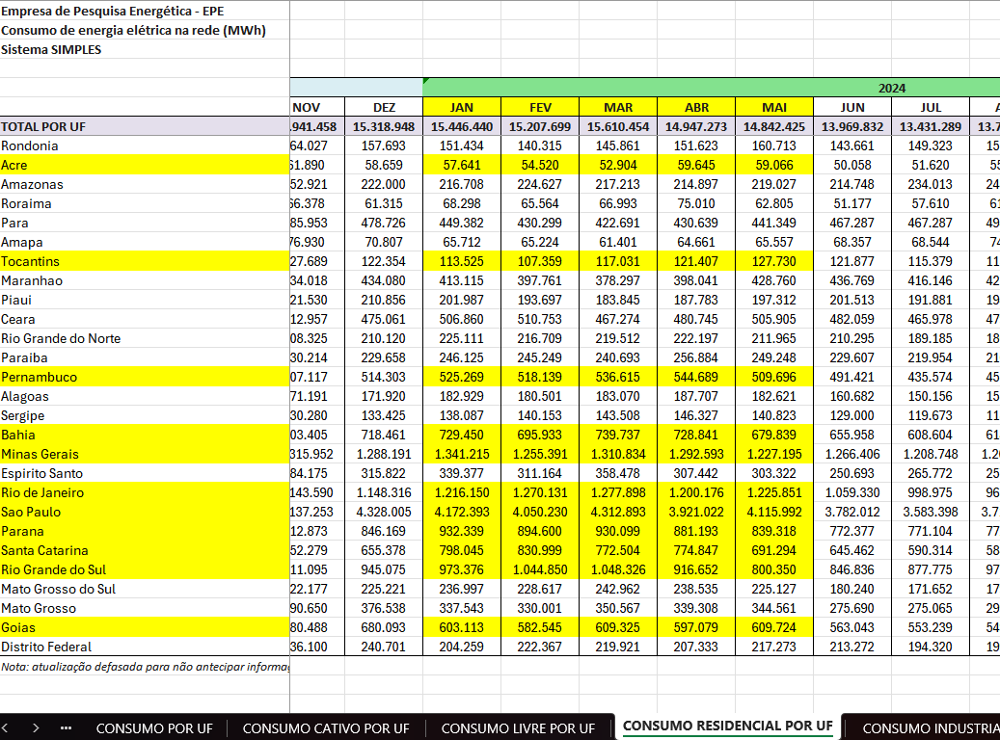

# What are we looking at?

The energy usage from 11 States of Brazil (Jan/2024 -> May/2024), with mocked data to simulate contracts.

The data to populate the Database in this project was obtained from [epe](https://www.epe.gov.br/pt/publicacoes-dados-abertos/publicacoes/consumo-de-energia-eletrica).

Look in [contratos_with_comments.csv](contratos_with_comments.csv) to see what we are testing with the mocked contracts.